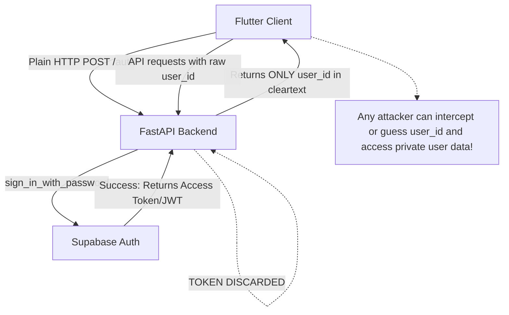

# Calorie Counter: Authentication & Security Analysis Report

This report provides a comprehensive, detailed audit of the authentication and authorization mechanism currently implemented in the **Calorie Counter** ecosystem (FastAPI Backend and Flutter Frontend). It highlights critical security vulnerabilities, architectural gaps, and lists missing features in detail, along with a prioritized action plan for modern production standards.

---

## 1. Current State of Authentication

The application uses **Supabase Auth** as the identity provider, but the integration is highly rudimentary and bypasses standard security models.

### Backend (FastAPI + Supabase)
- **File**: `main.py`
- **Endpoints**:
  - `POST /auth`: Authenticates user credentials via `supabase.auth.sign_in_with_password`. If successful, it queries the `users` table and returns only the static database row elements (e.g., `user_id` and calculated nutritional `goals`). **No access token (JWT) is returned to the client.**
  - `POST /profile`: Registers users via `supabase.auth.sign_up`. It calculates daily calorie targets, stores user profile info in a database table called `users`, and returns the `user_id`.
- **Other Protected Endpoints** (`/log_meal`, `/close_day`, `/history`):
  - These endpoints take `user_id` as a plain URL query parameter or JSON body parameter.
  - They **do not require or validate any HTTP authorization headers, JWTs, or session cookies**.

### Frontend (Flutter App)
- **File**: `main.dart`
- **Implementation**:
  - `LoginScreen` uses a standard username/password form and calls `/auth`. On success, it holds the `userId` and daily goals in-memory and pushes the `MainNavigationScreen`.
  - `OnboardingScreen` handles registration by calling `/profile`.
  - **Logout**: The logout function simply triggers `Navigator.pushReplacement` back to `LoginScreen`, clearing only the in-memory state.
  - **No local state storage** is used.

---

## 2. Severe Security Vulnerabilities & Architectural Flaws

Before listing missing features, it is critical to outline the underlying vulnerabilities present in the current architecture:



### A. Broken Object Level Authorization (BOLA / IDOR)
*   **The Issue**: The backend API relies entirely on the client-supplied `user_id` integer (e.g., `/history?user_id=5`) to fetch and record meals or generate dietitian reports.
*   **The Vulnerability**: There is **no authentication/authorization token check** on these endpoints. Anyone (or any malicious client) can fetch or corrupt the private health data, dietitian reports, and meal histories of any other user simply by guessing or iterating the integer `user_id`.

### B. Lack of Session Persistence (State Expiry)
*   **The Issue**: The Flutter frontend does not store credentials or session tokens in secure local storage (e.g., `flutter_secure_storage` or `shared_preferences`).
*   **The Vulnerability**: Every time the user closes the app, kills the process, or rotates the screen in certain lifecycle events, their in-memory state is wiped. They are forced to manually enter their email and password every single time they open the app.

### C. Plaintext Credential Transmission over Local Code
*   **The Issue**: Password constraints are checked only via a naive `password.length < 6` rule on the client. 
*   **The Vulnerability**: The password is sent in plaintext JSON strings directly over HTTP/HTTPS to the backend. While HTTPS encrypts in transit, standard practices dictate that clients or backends must enforce password complexity guidelines to prevent brute-forcing.

---

## 3. Comprehensive List of Missing Features

Below is a detailed list of missing authentication, authorization, and session-management features, classified by implementation priority.

### P0: Critical Security & Session Management (High Urgency)

#### 1. Token-Based Authentication (JWT) & Endpoint Guarding
*   **Description**: The backend must stop accepting raw `user_id` parameters as proof of identity.
*   **Frontend requirement**: The client must send a Bearer Token (JWT access token) in the `Authorization` header (`Authorization: Bearer <JWT_TOKEN>`) for every network request.
*   **Backend requirement**: FastAPI must use a security dependency (e.g., `HTTPBearer` from `fastapi.security`) that decodes and validates the Supabase JWT. It should extract the user's Supabase authenticated `uuid` from the token and perform database queries based on this cryptographically verified identity, rather than an arbitrary client-passed integer.

#### 2. Local Session Persistence (Auto-Login)
*   **Description**: Securely persist the login session on the mobile device.
*   **Implementation**: 
  - Install `flutter_secure_storage` on the client.
  - Upon successful login, save the JWT access token and refresh token in secure storage (keychain/keystore).
  - During app startup (`main.dart`), check if a valid token exists. If yes, automatically navigate the user to the `MainNavigationScreen` (bypass `LoginScreen`).

#### 3. Token Refresh Mechanism
*   **Description**: Supabase JWT tokens typically expire in 1 hour. 
*   **Implementation**: 
  - The client must intercept `401 Unauthorized` errors or check token expiry.
  - The backend or client must implement a `/refresh` endpoint (or call Supabase refresh logic) using the stored refresh token to silently obtain a new access token without interrupting the user's experience.

---

### P1: Essential Identity & Access Management (Medium Urgency)

#### 4. Email Format Verification & Verification Email Flow
*   **Description**: Currently, users can register with dummy/non-existent emails (e.g., `test@test`).
*   **Implementation**:
  - Enforce strict regex validation on the email text input fields in `main.dart`.
  - Enable Supabase's built-in "Confirm Email" setting.
  - The backend `/profile` endpoint should require the user to confirm their email before enabling write access to database resources, preventing junk registrations.

#### 5. Forgot Password / Password Reset Flow
*   **Description**: There is absolutely no way for a user to recover or change their password.
*   **Implementation**:
  - Add a **"Forgot Password?"** button on `LoginScreen`.
  - Add a backend endpoint (`POST /auth/forgot-password`) that triggers Supabase's `auth.reset_password_for_email()`.
  - Implement a redirection handler (deep link) in Flutter that receives the recovery token, opens a **Reset Password Screen**, and allows the user to securely write a new password.

#### 6. Registration Password Confirmation & Strength Validator
*   **Description**: In `OnboardingScreen`, a user can mistype their password during account creation and immediately lock themselves out because there is no "Confirm Password" check.
*   **Implementation**:
  - Add a `Confirm Password` text field.
  - Implement a password strength indicator showing if the password contains a mix of letters, numbers, and special symbols.

---

### P2: Premium User Experience, Compliance & Advanced Security

#### 7. Third-Party OAuth Social Logins (Google & Apple Sign-In)
*   **Description**: Modern health and calorie-tracking apps require instant onboarding to maximize user retention. 
*   **Implementation**:
  - Integrate `google_sign_in` and `sign_in_with_apple` packages into the Flutter app.
  - Enable OAuth providers in the Supabase console.
  - Pass the identity provider's ID token to the backend, which logs the user in/signs them up via Supabase's federated auth.

#### 8. User Account Self-Deletion & Data Purge (Compliance)
*   **Description**: Apple App Store Review Guidelines (Guideline 5.1.1) and GDPR mandate that any app supporting account creation must also allow users to initiate account deletion from within the app.
*   **Implementation**:
  - Add a **"Delete Account"** button inside a Settings screen.
  - Create a backend endpoint (`DELETE /profile`) that deletes the user from the Supabase auth table and recursively purges their records from the `users` and `meals` tables.

#### 9. API Rate Limiting & Brute-Force Protection
*   **Description**: The `/auth` endpoint is currently wide open to credential-stuffing and dictionary attacks.
*   **Implementation**:
  - Integrate a rate-limiter middleware on the FastAPI server (e.g., using `slowapi` or native Supabase rate limits).
  - Limit login attempts per IP address/email (e.g., maximum 5 attempts per 15 minutes) to protect accounts from brute-force penetration.

#### 10. Multi-Factor Authentication (MFA)
*   **Description**: For users who want maximum security for their clinical dietitian reports and metrics.
*   **Implementation**:
  - Leverage Supabase MFA (Time-based One-time Password - TOTP).
  - Add an MFA enrollment screen in the user profile settings, displaying a QR code that can be scanned with authenticator apps like Google Authenticator or 1Password.

---

## 4. Summary of Required Package Changes

### Frontend (`pubspec.yaml`)
To resolve these issues, the following packages must be added:
```yaml
dependencies:
  # Secure storage for saving access and refresh tokens locally
  flutter_secure_storage: ^9.0.0
  
  # Optional: Client-side Supabase SDK if moving to direct Supabase client flow
  supabase_flutter: ^2.5.0
```

### Backend (`requirements.txt`)
```text
# For JWT decoding and validation (if manually verifying Supabase tokens in FastAPI)
python-jose[cryptography]==3.3.0
# For rate limiting security endpoints
slowapi==0.1.9
```

---

## 5. Technical Roadmap for Remediation

To secure the authentication module, the following steps are recommended:

1.  **JWT Guarding (Backend)**: Add a FastAPI dependency that intercepts the `Authorization: Bearer <token>` header, decodes the JWT using Supabase's JWT secret key, and resolves the user's `email` or `uuid`. Change all databases calls (like `/log_meal`) to query the data by the authenticated user's ID resolved from the token, not a query parameter.
2.  **Token Flow (Frontend & Backend)**: Update the backend `/auth` and `/profile` response to include the Supabase `access_token` and `refresh_token`.
3.  **Local Storage (Frontend)**: Update the Flutter client to save the tokens upon login and load them on startup, executing a silent authentication check. Add auto-navigation if a valid session exists.
4.  **Security Features**: Implement the "Confirm Password" field on the signup form, and add forgot-password/recovery workflows.
